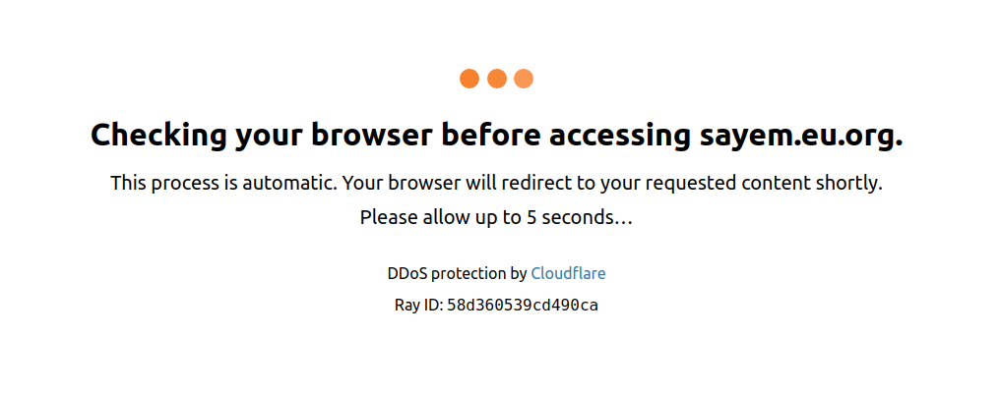

## hooman [](https://travis-ci.org/sayem314/hooman)

An http interceptor using got to bypass cloudflare ddos protection on nodejs.



## Install

```shell
# with npm: npm i hooman
yarn add hooman
```

## Usage

```js
const got = require("hooman");

got("https://sayem.eu.org")
  .then(response => {
    console.log(response.body);
  })
  .catch(error => {
    console.error(error);
  });
```

All methods and props of [got](https://github.com/sindresorhus/got) should work fine.
